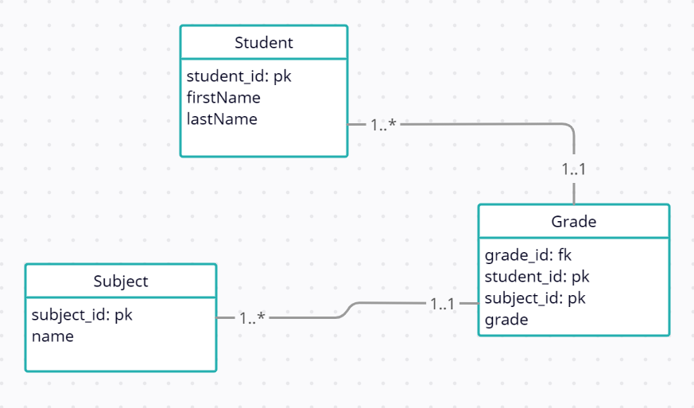

# Database design



# SQL Query

```sql
SELECT TOP 10 PERCENT student.student_id, student.firstName, student.lastName, AVG(grade.grade) AS AVG_GRADE
FROM student 
JOIN grade ON grade.student_id = student.student_id
GROUP BY student.student_id
ORDER BY AVG_GRADE
```

